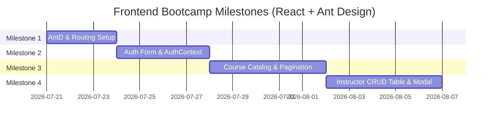

# 🎨 Frontend Building Guidelines & Architecture (React + Ant Design)

This guide provides a detailed, step-by-step architecture specification for building the **Online Course Platform Frontend** (`course-platform-web`).

> **Tech Stack:** React 19 · Vite · Ant Design (`antd`) · Ant Design Icons (`@ant-design/icons`) · Tailwind CSS · React Router DOM (`v6/v7`) · Axios

---

## 📚 Table of Contents

1. [Tech Stack & Library Setup](#1-tech-stack--library-setup)
2. [API Integration Layer](#2-api-integration-layer)
3. [Authentication & State Management](#3-authentication--state-management)
4. [Routing & Guard Architecture](#4-routing--guard-architecture)
5. [Layouts & Navigation (Ant Design Layout)](#5-layouts--navigation-ant-design-layout)
6. [Detailed Page-by-Page Implementation](#6-detailed-page-by-page-implementation)
   - [6.1 Authentication (Login & Register)](#61-authentication-login--register)
   - [6.2 Course Catalog & Detail (Public / Student)](#62-course-catalog--detail-public--student)
   - [6.3 Student Dashboard & Learning Module](#63-student-dashboard--learning-module)
   - [6.4 Instructor Dashboard (Course CRUD & Content)](#64-instructor-dashboard-course-crud--content)
   - [6.5 Admin Dashboard (User & Platform Management)](#65-admin-dashboard-user--platform-management)
7. [Step-by-Step Student Teaching Roadmap](#7-step-by-step-student-teaching-roadmap)

---

## 1. ⚙ Tech Stack & Library Setup

### 1.1 Install Prerequisites

Run in the `course-platform-web` directory:

```bash
npm install antd @ant-design/icons axios react-router-dom
```

### 1.2 Ant Design + Tailwind CSS Coexistence

Ant Design v5 uses CSS-in-JS (Design Tokens) while Tailwind CSS v4 provides utility classes. To avoid style reset conflicts:

`src/main.jsx`

```jsx
import React from 'react';
import ReactDOM from 'react-dom/client';
import { ConfigProvider } from 'antd';
import App from './App';
import './index.css';

ReactDOM.createRoot(document.getElementById('root')).render(
  <React.StrictMode>
    <ConfigProvider
      theme={{
        token: {
          colorPrimary: '#1677ff', // Brand primary color
          borderRadius: 8,
          fontFamily: 'Inter, system-ui, sans-serif',
        },
      }}
    >
      <App />
    </ConfigProvider>
  </React.StrictMode>
);
```

---

## 2. 🔌 API Integration Layer

Aligning the frontend HTTP requests with the backend API standard format:

### 2.1 Backend Standard API Envelope

All backend endpoints (`course-platform-api`) return JSON in this standard envelope:

```json
{
  "message": "Courses retrieved successfully",
  "data": [ ... ],
  "pagination": {
    "page": 1,
    "limit": 10,
    "total": 42,
    "totalPages": 5,
    "hasPrev": false,
    "hasNext": true
  }
}
```

### 2.2 Axios Service Setup

`src/services/api.js`

```javascript
import axios from 'axios';
import { message } from 'antd';

const api = axios.create({
  baseURL: import.meta.env.VITE_API_URL || 'http://localhost:5000',
  headers: {
    'Content-Type': 'application/json',
  },
});

// Request Interceptor: Attach JWT Token
api.interceptors.request.use(
  (config) => {
    const token = localStorage.getItem('token');
    if (token) {
      config.headers.Authorization = `Bearer ${token}`;
    }
    return config;
  },
  (error) => Promise.reject(error)
);

// Response Interceptor: Global Error Handling with Ant Design message
api.interceptors.response.use(
  (response) => response.data, // Returns { message, data, pagination }
  (error) => {
    const errMsg = error.response?.data?.message || 'An unexpected error occurred';
    
    if (error.response?.status === 401) {
      message.error('Session expired. Please log in again.');
      localStorage.removeItem('token');
      localStorage.removeItem('user');
      window.location.href = '/login';
    } else if (error.response?.status === 403) {
      message.error('You do not have permission to perform this action.');
    } else {
      message.error(errMsg);
    }
    
    return Promise.reject(error);
  }
);

export default api;
```

---

## 3. 🔐 Authentication & State Management

Manage user authentication state globally using React Context so all components can check `user`, `role`, and `isAuthenticated`.

`src/context/AuthContext.jsx`

```jsx
import React, { createContext, useState, useEffect, useContext } from 'react';
import api from '../services/api';

const AuthContext = createContext(null);

export const AuthProvider = ({ children }) => {
  const [user, setUser] = useState(() => {
    const savedUser = localStorage.getItem('user');
    return savedUser ? JSON.parse(savedUser) : null;
  });
  const [loading, setLoading] = useState(false);

  const login = async (phone, password) => {
    setLoading(true);
    try {
      const response = await api.post('/auth/login', { phone, password });
      const { token, user: userData } = response.data;
      
      localStorage.setItem('token', token);
      localStorage.setItem('user', JSON.stringify(userData));
      setUser(userData);
      return userData;
    } finally {
      setLoading(false);
    }
  };

  const register = async (username, phone, password, role = 'student') => {
    setLoading(true);
    try {
      const response = await api.post('/auth/register', { username, phone, password, role });
      return response;
    } finally {
      setLoading(false);
    }
  };

  const logout = () => {
    localStorage.removeItem('token');
    localStorage.removeItem('user');
    setUser(null);
  };

  return (
    <AuthContext.Provider value={{ user, loading, login, register, logout, isAuthenticated: !!user }}>
      {children}
    </AuthContext.Provider>
  );
};

export const useAuth = () => useContext(AuthContext);
```

---

## 4. 🧭 Routing & Guard Architecture

`src/routes/AppRoutes.jsx`

Use Ant Design `Result` component for unauthorized access (403/404) and loading spinners (`Spin`).

```jsx
import { Routes, Route, Navigate } from 'react-router-dom';
import { useAuth } from '../context/AuthContext';
import { Result, Button, Spin } from 'antd';

// Layouts
import MainLayout from '../layouts/MainLayout';
import DashboardLayout from '../layouts/DashboardLayout';

// Pages
import HomePage from '../pages/HomePage';
import CourseListPage from '../pages/CourseListPage';
import CourseDetailPage from '../pages/CourseDetailPage';
import LoginPage from '../pages/LoginPage';
import RegisterPage from '../pages/RegisterPage';

import StudentDashboard from '../pages/student/StudentDashboard';
import LessonViewerPage from '../pages/student/LessonViewerPage';

import InstructorDashboard from '../pages/instructor/InstructorDashboard';
import CourseFormPage from '../pages/instructor/CourseFormPage';

import AdminDashboard from '../pages/admin/AdminDashboard';
import UserManagementPage from '../pages/admin/UserManagementPage';

// Protected Route Guard
const ProtectedRoute = ({ children, allowedRoles }) => {
  const { user, isAuthenticated, loading } = useAuth();

  if (loading) return <div className="h-screen flex items-center justify-center"><Spin size="large" /></div>;
  if (!isAuthenticated) return <Navigate to="/login" replace />;
  if (allowedRoles && !allowedRoles.includes(user?.role)) {
    return (
      <Result
        status="403"
        title="403"
        subTitle="Sorry, you are not authorized to access this page."
        extra={<Button type="primary" href="/">Back Home</Button>}
      />
    );
  }

  return children;
};

export default function AppRoutes() {
  return (
    <Routes>
      {/* Public Pages */}
      <Route element={<MainLayout />}>
        <Route path="/" element={<HomePage />} />
        <Route path="/courses" element={<CourseListPage />} />
        <Route path="/courses/:id" element={<CourseDetailPage />} />
        <Route path="/login" element={<LoginPage />} />
        <Route path="/register" element={<RegisterPage />} />
      </Route>

      {/* Student Protected Routes */}
      <Route element={<ProtectedRoute allowedRoles={['student', 'instructor', 'admin']}><DashboardLayout /></ProtectedRoute>}>
        <Route path="/student/dashboard" element={<StudentDashboard />} />
        <Route path="/student/lessons/:id" element={<LessonViewerPage />} />
      </Route>

      {/* Instructor Protected Routes */}
      <Route element={<ProtectedRoute allowedRoles={['instructor', 'admin']}><DashboardLayout /></ProtectedRoute>}>
        <Route path="/instructor/dashboard" element={<InstructorDashboard />} />
        <Route path="/instructor/courses/new" element={<CourseFormPage />} />
        <Route path="/instructor/courses/:id/edit" element={<CourseFormPage />} />
      </Route>

      {/* Admin Protected Routes */}
      <Route element={<ProtectedRoute allowedRoles={['admin']}><DashboardLayout /></ProtectedRoute>}>
        <Route path="/admin/dashboard" element={<AdminDashboard />} />
        <Route path="/admin/users" element={<UserManagementPage />} />
      </Route>

      {/* 404 Fallback */}
      <Route path="*" element={<Result status="404" title="404" subTitle="Page not found" />} />
    </Routes>
  );
}
```

---

## 5. 🖼 Layouts & Navigation (Ant Design Layout)

### 5.1 Main Layout (Public Navbar + Footer)

`src/layouts/MainLayout.jsx`

Uses Ant Design `Layout`, `Header`, `Menu`, `Avatar`, `Dropdown`, and `Footer`.

```jsx
import { Layout, Menu, Button, Dropdown, Avatar, Space } from 'antd';
import { UserOutlined, LogoutOutlined, DashboardOutlined, BookOutlined } from '@ant-design/icons';
import { Outlet, useNavigate, useLocation } from 'react-router-dom';
import { useAuth } from '../context/AuthContext';

const { Header, Content, Footer } = Layout;

export default function MainLayout() {
  const { user, isAuthenticated, logout } = useAuth();
  const navigate = useNavigate();
  const location = useLocation();

  const userMenuItems = [
    {
      key: 'dashboard',
      icon: <DashboardOutlined />,
      label: 'Dashboard',
      onClick: () => navigate(`/${user?.role}/dashboard`),
    },
    {
      type: 'divider',
    },
    {
      key: 'logout',
      icon: <LogoutOutlined />,
      label: 'Logout',
      danger: true,
      onClick: () => {
        logout();
        navigate('/login');
      },
    },
  ];

  return (
    <Layout className="min-h-screen">
      <Header className="flex items-center justify-between bg-white px-8 shadow-sm border-b">
        <div className="flex items-center gap-8">
          <div className="text-xl font-bold text-blue-600 cursor-pointer flex items-center gap-2" onClick={() => navigate('/')}>
            <BookOutlined /> CoursePlatform
          </div>
          <Menu
            mode="horizontal"
            selectedKeys={[location.pathname]}
            className="border-none min-w-[300px]"
            items={[
              { key: '/', label: 'Home', onClick: () => navigate('/') },
              { key: '/courses', label: 'All Courses', onClick: () => navigate('/courses') },
            ]}
          />
        </div>

        <div>
          {isAuthenticated ? (
            <Dropdown menu={{ items: userMenuItems }} placement="bottomRight">
              <Space className="cursor-pointer">
                <Avatar icon={<UserOutlined />} className="bg-blue-500" />
                <span className="font-medium">{user?.username}</span>
              </Space>
            </Dropdown>
          ) : (
            <Space>
              <Button onClick={() => navigate('/login')}>Login</Button>
              <Button type="primary" onClick={() => navigate('/register')}>Register</Button>
            </Space>
          )}
        </div>
      </Header>

      <Content className="p-8 max-w-7xl w-full mx-auto">
        <Outlet />
      </Content>

      <Footer className="text-center bg-gray-100 py-6">
        Online Course Platform ©2026 Built for Bootcamp Learning
      </Footer>
    </Layout>
  );
}
```

---

## 6. 📝 Detailed Page-by-Page Implementation

### 6.1 Authentication (Login & Register)

#### Login Page (`/login`)
* **API Endpoint**: `POST /auth/login`
* **Request Body**: `{ phone, password }`
* **Ant Design Components**: `Card`, `Form`, `Input`, `Button`, `Typography.Title`, `message`

```jsx
// Highlights: Form validation rule for required fields, AntD Form.Item
<Form name="login" onFinish={onFinish} layout="vertical" size="large">
  <Form.Item name="phone" label="Phone Number" rules={[{ required: true, message: 'Please input your phone!' }]}>
    <Input prefix={<PhoneOutlined />} placeholder="Phone Number" />
  </Form.Item>
  <Form.Item name="password" label="Password" rules={[{ required: true, message: 'Please input your password!' }]}>
    <Input.Password prefix={<LockOutlined />} placeholder="Password" />
  </Form.Item>
  <Button type="primary" htmlType="submit" block loading={loading}>Log in</Button>
</Form>
```

#### Register Page (`/register`)
* **API Endpoint**: `POST /auth/register`
* **Request Body**: `{ username, phone, password, role }`
* **Ant Design Components**: `Form`, `Input.Password`, `Select` (Role selection: `student` or `instructor`).

---

### 6.2 Course Catalog & Detail (Public / Student)

#### Course List Page (`/courses`)
* **API Endpoint**: `GET /courses`
* **Query Parameters**: `page`, `limit`, `search`, `category`, `level`, `minPrice`, `maxPrice`, `sortBy`, `order`
* **Ant Design Components**: `Input.Search`, `Select`, `Card`, `Badge`, `Tag`, `Pagination`, `Row`, `Col`, `Empty`, `Spin`

```jsx
// Alignment with API pagination:
const fetchCourses = async (params) => {
  setLoading(true);
  try {
    const res = await api.get('/courses', { params });
    setCourses(res.data);
    setPagination(res.pagination); // { page, limit, total, totalPages, hasPrev, hasNext }
  } finally {
    setLoading(false);
  }
};

// Render Pagination Control
<Pagination
  current={pagination.page}
  pageSize={pagination.limit}
  total={pagination.total}
  onChange={(page, pageSize) => fetchCourses({ page, limit: pageSize, search, category })}
  showSizeChanger
  className="mt-8 text-center"
/>
```

#### Course Card UI (AntD `Card`)

```jsx
<Card
  hoverable
  cover={}
  actions={[
    <Button type="link" onClick={() => navigate(`/courses/${course.id}`)}>View Details</Button>
  ]}
>
  <Tag color={course.level === 'Beginner' ? 'green' : 'blue'}>{course.level}</Tag>
  <Card.Meta title={course.title} description={course.description} />
  <div className="mt-4 flex justify-between items-center">
    <span className="text-lg font-bold text-green-600">${course.price}</span>
    <span className="text-sm text-gray-500">Instructor: {course.instructor?.username || 'N/A'}</span>
  </div>
</Card>
```

#### Course Detail Page (`/courses/:id`)
* **API Endpoint**: `GET /courses/:id`
* **Ant Design Components**: `Descriptions`, `Tag`, `Collapse` (for Sections & Lessons list), `Button` (Enroll in Course).

---

### 6.3 Student Dashboard & Learning Module

#### Student Dashboard (`/student/dashboard`)
* **API Endpoint**: `GET /enrollments/my-courses`
* **Ant Design Components**: `Progress` (Lesson completion percentage), `List`, `Card`, `Tag`.

#### Lesson Viewer Page (`/student/lessons/:id`)
* **API Endpoint**: `GET /lessons/:id`, `POST /progress` (Mark lesson as completed)
* **Ant Design Components**: `Breadcrumb`, `Button`, `CheckCircleOutlined`, `Spin`.

---

### 6.4 Instructor Dashboard (Course CRUD & Content)

#### Course Management (`/instructor/dashboard`)
* **API Endpoints**: 
  * `GET /courses?instructorId={user.id}`
  * `POST /courses`
  * `PUT /courses/:id`
  * `DELETE /courses/:id` (Hard delete)
  * `PATCH /courses/:id` (Soft delete)
* **Ant Design Components**: `Table`, `Button`, `Popconfirm`, `Modal`, `Form`, `Input`, `InputNumber`, `Select`, `Space`.

```jsx
// Instructor Ant Design Table Columns Definition
const columns = [
  { title: 'ID', dataIndex: 'id', key: 'id', width: 70 },
  { title: 'Title', dataIndex: 'title', key: 'title' },
  { title: 'Category', dataIndex: 'category', key: 'category' },
  { title: 'Level', dataIndex: 'level', key: 'level', render: (level) => <Tag color="blue">{level}</Tag> },
  { title: 'Price', dataIndex: 'price', key: 'price', render: (val) => `$${val}` },
  {
    title: 'Actions',
    key: 'actions',
    render: (_, record) => (
      <Space>
        <Button size="small" icon={<EditOutlined />} onClick={() => handleEdit(record)}>Edit</Button>
        <Popconfirm title="Delete course?" onConfirm={() => handleDelete(record.id)}>
          <Button size="small" danger icon={<DeleteOutlined />}>Delete</Button>
        </Popconfirm>
      </Space>
    ),
  },
];
```

---

### 6.5 Admin Dashboard (User & Platform Management)

#### User Management Page (`/admin/users`)
* **API Endpoints**: `GET /users`, `POST /users`, `PUT /users/:id`
* **Ant Design Components**: `Table`, `Tag` (Role Badges: `student` = blue, `instructor` = purple, `admin` = red), `Modal`, `Switch`.

```jsx
const roleColors = {
  admin: 'gold',
  instructor: 'purple',
  student: 'blue',
};

// Render role column in Table
{
  title: 'Role',
  dataIndex: 'role',
  render: (role) => <Tag color={roleColors[role] || 'default'}>{role.toUpperCase()}</Tag>
}
```

---

## 7. 🎓 Step-by-Step Student Teaching Roadmap

Assign these milestones sequentially to students:



| Milestone | Target Output | Key AntD Components Learned |
| :--- | :--- | :--- |
| **Milestone 1** | App Shell, React Router & Main Layout | `Layout`, `Header`, `Menu`, `Footer` |
| **Milestone 2** | Login / Register Pages + Axios Interceptor | `Form`, `Input`, `Button`, `message` |
| **Milestone 3** | Course Catalog with Search, Filters & Pagination | `Card`, `Input.Search`, `Select`, `Pagination` |
| **Milestone 4** | Instructor Management Dashboard (CRUD) | `Table`, `Modal`, `Popconfirm`, `Tag` |
| **Milestone 5** | Student Learning Viewer & Progress Tracking | `Progress`, `Collapse`, `Result`, `Spin` |

---

### 💡 Summary Checklist for Students
- [ ] Configured `ConfigProvider` for Ant Design global theme.
- [ ] Built `api.js` with Axios interceptors attaching `Authorization: Bearer <token>`.
- [ ] Implemented `AuthContext` to handle login/logout state.
- [ ] Created `ProtectedRoute` to restrict routes by role.
- [ ] Connected Ant Design `Pagination` to backend `pagination` metadata envelope.
